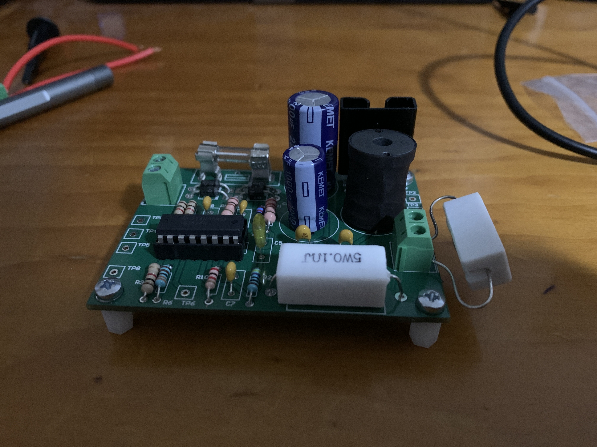
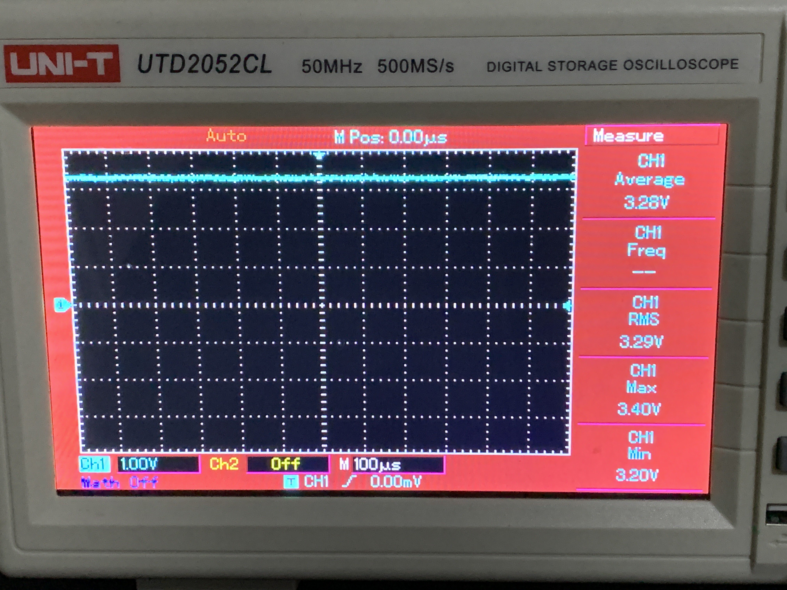
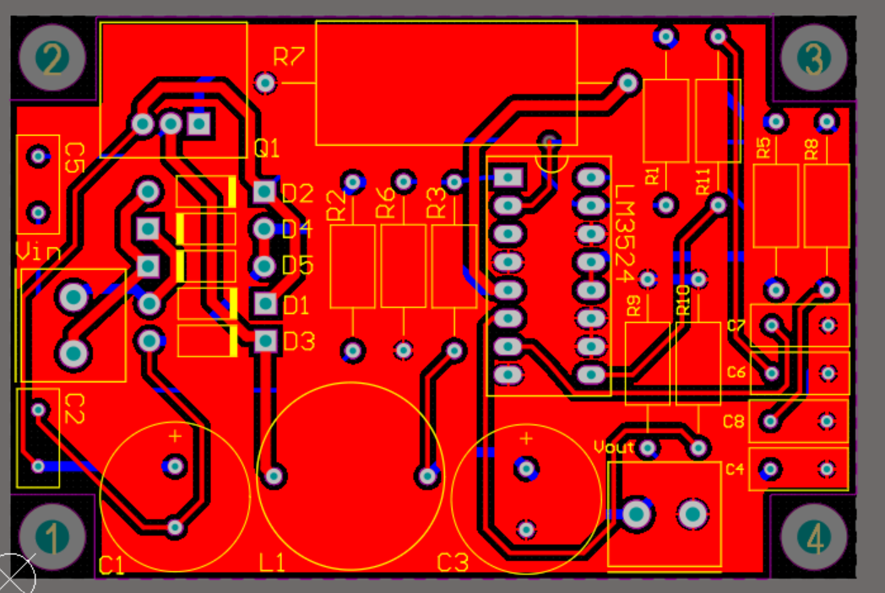
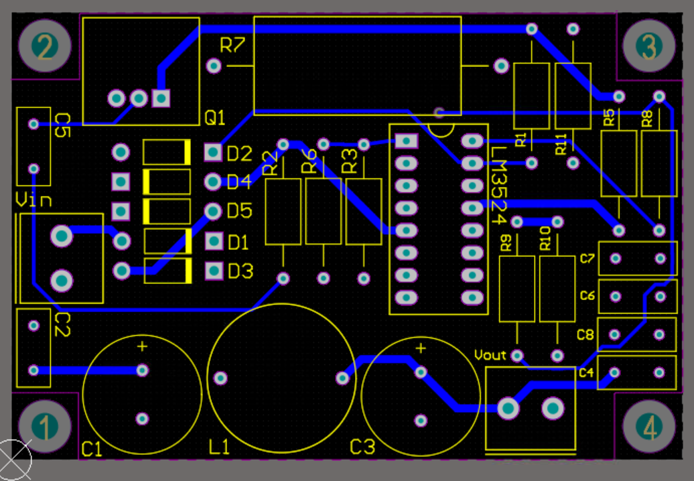
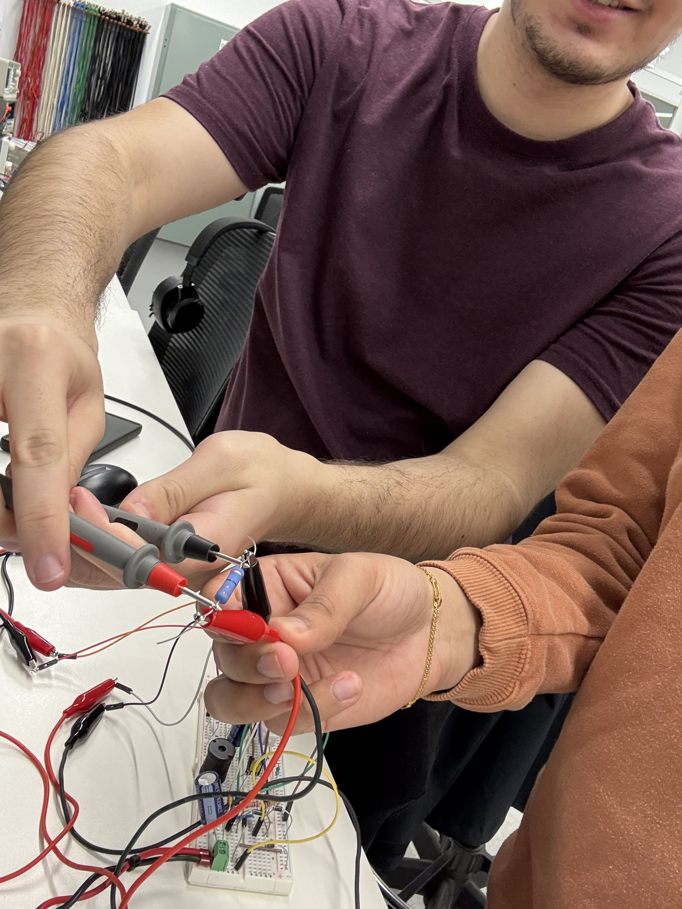

# buck-converter-3v3-power-supply
3.3V/1A buck converter power supply — LM3524 PWM controller design and validation.

# 3.3V Buck Converter Power Supply

A regulated 3.3V/1A DC power supply built from a 12V AC input, designed, simulated, and validated on hardware as part of RMIT's Engineering Design 2 course.

**Team:** Neil Chohan, Taj Vass, Rodrigo Collioni Ribeiro

## Overview

This project converts a 12V AC input into a stable, low-ripple 3.3V DC output capable of delivering up to 1A, using a buck (step-down) converter topology controlled by an **LM3524 PWM controller**. The design covers the full power path — rectification, filtering, PWM switching, and closed-loop feedback regulation.

## Key Results

| Metric | Target | Achieved |
|---|---|---|
| Output ripple (rated load, 1A) | < 66 mV (2%) | 8.29 mV (measured) |
| Output ripple (medium load, 330mA) | < 66 mV | 5.91 mV |
| Output ripple (light load, 50mA) | < 66 mV | 1.00 mV |
| Switching frequency | 100 kHz | ~105 kHz (sim) / 100–110 kHz (measured) |
| Output voltage | 3.3 V | 3.1–3.3 V across all load conditions |
| Rectifier ripple | < 30% | 6.9% |

*Measured output voltage — stable at ~3.28V average, matching the simulated and target 3.3V within tolerance.*

*Switching waveform captured at the PWM node — measured frequency of 106.59kHz, closely matching the 100kHz design target.*

## How It Works

1. **Rectification** — A full-bridge rectifier converts 12V AC into ~15.6V DC, smoothed by a 2200 µF capacitor.
2. **PWM Control** — The LM3524 compares the output feedback voltage against an internal 2.5V reference and generates a PWM signal at ~100 kHz.
3. **Switching Stage** — A P-channel MOSFET (IRF9540N) switches the rectified input according to the PWM duty cycle.
4. **Output Filtering** — A freewheeling diode, 100 µH inductor, and 1000 µF capacitor smooth the switched waveform into clean DC.
5. **Feedback & Protection** — A resistor divider network scales the output for the error amplifier, a snubber suppresses switching spikes, and a current-sense resistor protects against overcurrent.

## Design Process

Component values were calculated from datasheet equations and iteratively refined through simulation and hardware testing. For example, the output filter capacitor (C3) was initially calculated at 4.7 µF, but bench testing showed this was insufficient for the target ripple — it was increased to 1000 µF, which brought measured ripple down to well within spec.

Simulation (Multisim) and hardware measurements (Keysight oscilloscope) were compared at three load conditions — light (50 mA), medium (330 mA), and rated (1A) — to confirm the regulator held a stable output across the full operating range.

## PCB Layout

The design was carried through to a fully routed PCB in Altium Designer. The final board passed Design Rule Check with **0 warnings and 0 rule violations**, confirming clean routing, correct clearances, and no unresolved electrical issues before assembly.

*Top copper layer routing — full board layout including rectifier, PWM controller, MOSFET switching stage, and output filter.*

*Routing overlay highlighting key signal traces across the board.*

## Hardware Assembly & Testing

*Fully assembled and soldered PCB.*

*Component-level testing during assembly and debugging.*

## Repository Contents

- `DesignProject/BuckConverterSchematic.SchDoc` — Altium schematic
- `DesignProject/ProjectPCB.PcbDoc` — Routed PCB layout
- `DesignProject/*.PcbLib`, `*.SchLib` — Component footprint and symbol libraries used in the design
- `DesignProject/Project Outputs for DesignProject/Design Rule Check - ProjectPCB.html` — DRC report (0 warnings, 0 violations)
- `DesignProject/project_sim_config.simcfg`, `LM3524.ckt` — Simulation configuration
- `Design_Report.pdf` — Full write-up with detailed calculations and experimental analysis

## Tools Used

Altium Designer (schematic capture, PCB layout, DRC), Multisim (circuit simulation), Keysight oscilloscope (hardware validation), PCB assembly and testing.

## Datasheets Referenced

- Texas Instruments — LM3524D PWM Controller
- International Rectifier — IRF9540N HEXFET MOSFET
- Vishay — UF4004 Ultrafast Rectifier
